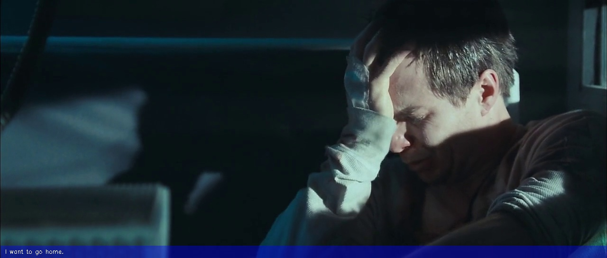
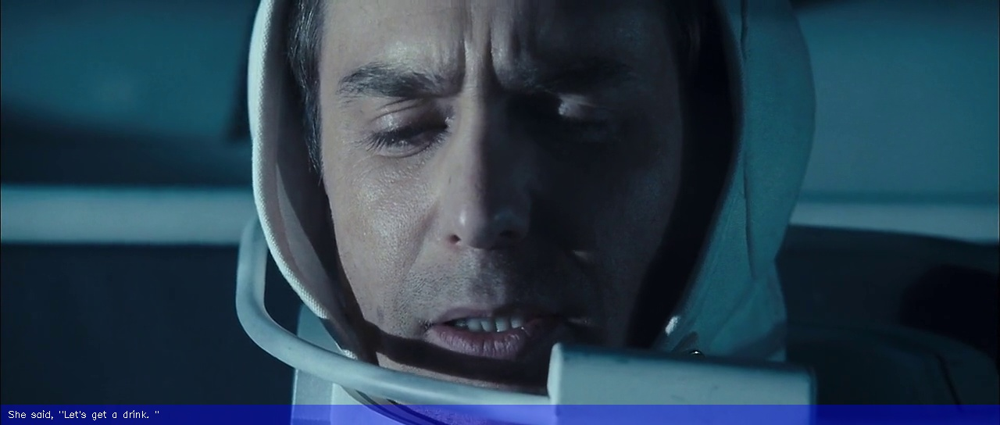

# SubScribe
Python Utility to convert your video files to images transcribed with their subtitles.

##The Idea
1. Download a video using `youtube-dl https://www.youtube.com/watch?v=PTmCxbcRXs4 --write-auto-sub` 
2. Run a script that uses the mp4 file and the srt file to generate an image (or a set of images) like this:


## Usage
1. Download a video using `youtube-dl https://www.youtube.com/watch?v=PTmCxbcRXs4 --write-auto-sub` or just have a video file with a corresponding srt file ready.
2. How to use:

```
python script.py --help
usage: script.py [-h] video sub

positional arguments:
  video       path to video file
  sub         path to sub file

optional arguments:
  -h, --help  show this help message and exit
```

3. Examples:
`python script.py samples/a/a.webm samples/a/a.srt`

## Sample Outputs

###Moon Movie






###Sample Youtube Videos


## Todo
- [ ] Think of a cool name for the repo.
- [ ] Add an optional youtube-dl wrapper
- [ ] Add to pip
- [ ] Improve text overlay, make it more visible and allow it to be modified using CLI
- [x] Add demos to readme.
- [ ] Add contributing.md


## Contributing
Post issues and send PRs.
